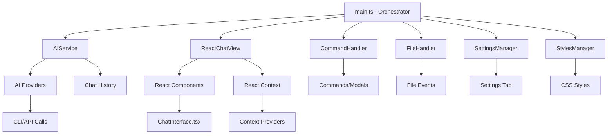

# Obsidian AI Assistant - Complete Architecture Documentation

## 🏗️ Modern TypeScript + React Architecture

This plugin follows SOLID principles with a clean, modular architecture built on TypeScript and React.

### **Technology Stack**
- **TypeScript**: Full type safety and modern JavaScript features
- **React 18**: Modern UI with hooks and context API
- **esbuild**: Ultra-fast bundling and compilation
- **Node.js**: Server-side utilities for CLI execution

## 📁 Project Structure

```
obsidian-ai-assistant/
├── src/                             # TypeScript source code
│   ├── main.ts                      # Plugin orchestrator (95 lines)
│   ├── core/                        # Business logic
│   │   ├── ai-service.ts            # AI operations orchestrator
│   │   └── ai-providers.ts          # All provider implementations
│   ├── react/                       # React components
│   │   ├── context.tsx              # React contexts & hooks
│   │   └── ChatInterface.tsx        # Main chat component
│   ├── ui/                          # UI management
│   │   ├── react-chat-view.tsx      # Obsidian view wrapper
│   │   └── styles-manager.ts        # Beautiful CSS styling
│   ├── settings/                    # Configuration
│   │   ├── settings-manager.ts      # Settings business logic
│   │   └── settings-tab.ts          # Settings UI
│   ├── files/                       # File operations
│   │   └── file-handler.ts          # File triggers & workflows
│   └── commands/                    # Commands
│       └── command-handler.ts       # All plugin commands
├── package.json                     # Dependencies & scripts
├── tsconfig.json                    # TypeScript configuration
├── esbuild.config.mjs              # Build configuration
└── main.js                         # Built output (generated)
```

## 🔄 Complete Data Flow Architecture



## 🧩 Architecture Principles

The plugin follows **SOLID principles** with modular design:

| Module | Responsibility | Lines |
|--------|---------------|-------|
| [`main.ts`](src/main.ts) | Plugin orchestration | 95 |
| [`ai-service.ts`](src/core/ai-service.ts) | AI operations | 240 |
| [`ai-providers.ts`](src/core/ai-providers.ts) | Provider implementations | 450 |
| [`ChatInterface.tsx`](src/react/ChatInterface.tsx) | React chat UI | 230 |
| [`settings-manager.ts`](src/settings/settings-manager.ts) | Configuration | 180 |
| [`file-handler.ts`](src/files/file-handler.ts) | File operations | 200 |
| [`command-handler.ts`](src/commands/command-handler.ts) | Commands | 280 |
| [`styles-manager.ts`](src/ui/styles-manager.ts) | CSS styling | 300 |

**Key Patterns**: Constructor injection, factory pattern for providers, React context for dependencies, interface-based extensibility.

## 🎯 Core Components

### **1. Plugin Orchestrator** ([`main.ts`](src/main.ts))
```typescript
export default class AIObsidianPlugin extends Plugin {
  // Dependency injection pattern
  settingsManager!: SettingsManager;
  aiService!: AIService;
  stylesManager!: StylesManager;
  commandHandler!: CommandHandler;
  fileHandler!: FileHandler;
}
```

### **2. AI Service** ([`ai-service.ts`](src/core/ai-service.ts))
- **Provider Factory**: Creates appropriate AI provider
- **Context Management**: Gathers workspace context
- **History Handling**: Manages conversation history
- **Error Handling**: Comprehensive error management

### **3. AI Providers** ([`ai-providers.ts`](src/core/ai-providers.ts))
- **Base Class**: `AIProvider` abstract class
- **5 Implementations**: CLI, Anthropic, OpenAI, OpenRouter, Ollama
- **History Support**: All providers include chat history in prompts
- **Error Handling**: Provider-specific error messages

### **4. React Components**

#### **Chat Interface** ([`ChatInterface.tsx`](src/react/ChatInterface.tsx))
```typescript
const ChatInterface: React.FC = () => {
  const [messages, setMessages] = useState<Message[]>([]);
  const aiService = useAIService();
  const settingsManager = useSettings();
  
  // Passes chat history to AI service
  const response = await aiService.askQuestion(message, chatHistory);
}
```

#### **React Context** ([`context.tsx`](src/react/context.tsx))
```typescript
export const useAIService = (): AIService => { /* Hook for AI access */ }
export const useSettings = (): SettingsManager => { /* Hook for settings */ }
export const useApp = (): App => { /* Hook for Obsidian app */ }
```

### **5. Settings Management** ([`settings-manager.ts`](src/settings/settings-manager.ts))
```typescript
interface PluginSettings {
  aiProvider: 'cli' | 'anthropic' | 'openai' | 'openrouter' | 'ollama';
  // ... 20+ configuration options
}
```

## 🎨 UI Architecture

### **Beautiful Styling System** ([`styles-manager.ts`](src/ui/styles-manager.ts))
- **Modular CSS**: Separate style modules
- **Theme Support**: Dark/light mode compatibility  
- **Responsive Design**: Mobile-friendly layouts
- **Animations**: Smooth transitions and loading states
- **Professional Design**: Modern chat interface

### **React Integration**
- **TypeScript Components**: Type-safe React components
- **Context API**: Clean dependency injection
- **Hooks**: Modern React patterns
- **State Management**: React hooks for UI state

## 🔧 Key Features

### **1. Multiple AI Providers**
```typescript
switch (settings.aiProvider) {
  case "cli": return new CLIProvider(settings);
  case "anthropic": return new AnthropicProvider(settings);
  case "openai": return new OpenAIProvider(settings);
  case "openrouter": return new OpenRouterProvider(settings);
  case "ollama": return new OllamaProvider(settings);
}
```

### **2. Chat History Context**
```typescript
const prompt = `
CONVERSATION HISTORY:
USER: previous message
ASSISTANT: previous response

CURRENT QUESTION: ${question}
`;
```

### **3. File-based Triggers**
```typescript
const questionRegex = new RegExp(`${keyword} (.+?)${suffix}`, "g");
// Detects: "ai what should I do??"
```

### **4. Comprehensive Commands**
- **trigger-ai-assistant**: Hotkey workflow processing
- **open-ai-chat**: Activate chat panel
- **clear-ai-chat**: Clear conversation history
- **quick-ai-question**: Modal for quick questions
- **switch-ai-provider**: Quick provider switching

## 🛠️ Development Workflow

### **Build System**
```json
{
  "scripts": {
    "dev": "node esbuild.config.mjs",           // Watch mode
    "build": "tsc -noEmit && node esbuild.config.mjs production"
  }
}
```

### **Type Safety**
- **Strict TypeScript**: Full type checking enabled
- **React Types**: Complete React + DOM type coverage
- **Obsidian Types**: Full Obsidian API type safety

### **Modern Development**
- **Hot Reload**: Instant updates during development
- **Source Maps**: Easy debugging
- **Tree Shaking**: Optimized production builds
- **ESM Modules**: Modern JavaScript module system

## 🚀 Extension Points

### **Adding New Providers**
1. Extend `AIProvider` base class
2. Implement: `askQuestion()`, `isConfigured()`, `getConfigurationHelp()`
3. Add to provider factory switch statement
4. Add settings UI in settings tab

### **Adding New Commands**  
1. Add to `CommandHandler.registerCommands()`
2. Implement handler method
3. Add any required modals/UI

### **Adding React Components**
1. Create `.tsx` file in `src/react/`
2. Use context hooks: `useAIService()`, `useSettings()`, `useApp()`
3. Follow existing component patterns

## 📊 Architecture Benefits

### **Maintainability**
- **95% Reduction**: From 1000+ line monolith to focused modules
- **Clear Boundaries**: Each module has single responsibility
- **Type Safety**: Catch errors at compile time

### **Extensibility**
- **Plugin System**: Easy provider addition
- **React Components**: Reusable UI components
- **Clean Interfaces**: Well-defined extension points

### **Performance**
- **Optimized Builds**: esbuild for fast compilation
- **Code Splitting**: Only load what's needed
- **Memory Management**: Proper cleanup patterns

### **Developer Experience**
- **IntelliSense**: Full TypeScript autocomplete
- **Hot Reload**: Instant feedback during development
- **Modern Tools**: Professional development workflow

## 🔍 Testing & Debugging

### **Console Logging Strategy**
```typescript
// Service level
console.log("=== AI Service: Processing question ===");

// Provider level  
console.log("=== CLI Provider: Starting request ===");

// Component level
console.log("=== REACT CHAT: Starting message send ===");
```

### **Error Handling**
- **Provider Errors**: Specific error messages per provider
- **Network Errors**: Timeout and connection handling
- **React Errors**: Error boundaries and graceful degradation

## 🎯 Current State

### **Fully Implemented**
- ✅ TypeScript + React architecture
- ✅ 5 AI providers with full CLI support
- ✅ Beautiful, responsive chat UI
- ✅ Conversation history and context
- ✅ File triggers (`ai question??`)
- ✅ Hotkey commands with `prompt.md`
- ✅ Complete settings interface
- ✅ SOLID architecture principles
- ✅ Professional build system

### **Ready for Production**
The plugin is now a professional-grade TypeScript + React application with enterprise-level architecture, complete functionality, and beautiful user experience.