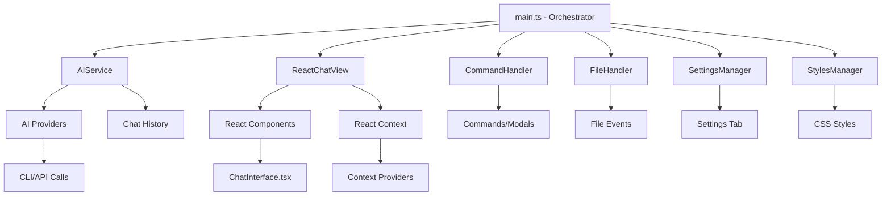

# Obsidian AI Assistant - Complete Architecture Documentation

## 🏗️ Modern TypeScript + React Architecture

This plugin follows SOLID principles with a clean, modular architecture built on TypeScript and React.

### **Technology Stack**
- **TypeScript**: Full type safety and modern JavaScript features
- **React 18**: Modern UI with hooks and context API
- **esbuild**: Ultra-fast bundling and compilation
- **Node.js**: Server-side utilities for CLI execution

## 📁 Project Structure

```
obsidian-ai-assistant/
├── src/                             # TypeScript source code
│   ├── main.ts                      # Plugin orchestrator (95 lines)
│   ├── core/                        # Business logic
│   │   ├── ai-service.ts            # AI operations orchestrator
│   │   ├── ai-providers.ts          # All provider implementations
│   │   └── conversation-manager.ts  # Conversation persistence & management
│   ├── react/                       # React components
│   │   ├── context.tsx              # React contexts & hooks
│   │   ├── ChatInterface.tsx        # Main chat component with ThemeProvider
│   │   ├── themes/                  # SOLID-compliant theme system
│   │   │   ├── types.ts             # Theme interfaces and contracts
│   │   │   ├── ThemeProvider.ts     # Factory pattern theme manager
│   │   │   ├── index.ts             # Central theme exports
│   │   │   ├── default/             # Default Obsidian theme
│   │   │   │   ├── Bubble.tsx       # Message bubble component
│   │   │   │   ├── Header.tsx       # Header with icon buttons
│   │   │   │   ├── Input.tsx        # Input component
│   │   │   │   ├── HistoryPanel.tsx # Professional history panel
│   │   │   │   └── index.ts         # Theme configuration
│   │   │   ├── imessage/            # iOS Messages theme
│   │   │   │   ├── Bubble.tsx       # iOS-style bubbles
│   │   │   │   ├── Header.tsx       # iOS-style header
│   │   │   │   ├── Input.tsx        # iOS-style input
│   │   │   │   ├── HistoryPanel.tsx # iOS Messages history panel
│   │   │   │   └── index.ts         # Theme configuration
│   │   │   ├── discord/             # Discord-style theme
│   │   │   │   ├── Bubble.tsx       # Discord bubbles with avatars
│   │   │   │   ├── Header.tsx       # Discord-style header
│   │   │   │   ├── Input.tsx        # Discord-style input
│   │   │   │   ├── HistoryPanel.tsx # Discord-style history panel
│   │   │   │   └── index.ts         # Theme configuration
│   │   │   └── minimal/             # Minimal clean theme
│   │   │       ├── Bubble.tsx       # Minimal bubbles
│   │   │       ├── Header.tsx       # Minimal header
│   │   │       ├── Input.tsx        # Minimal input
│   │   │       ├── HistoryPanel.tsx # Minimal history panel
│   │   │       └── index.ts         # Theme configuration
│   │   ├── themed-components/       # Legacy theme components (deprecated)
│   │   └── utils/                   # React utilities
│   │       └── AvatarGenerator.ts   # Random avatar generation system
│   ├── ui/                          # UI management
│   │   ├── react-chat-view.tsx      # Obsidian view wrapper
│   │   └── styles-manager.ts        # CSS styling + theme system
│   ├── settings/                    # Configuration
│   │   ├── settings-manager.ts      # Settings with theme support
│   │   └── settings-tab.ts          # Settings UI with theme selector
│   ├── files/                       # File operations
│   │   └── file-handler.ts          # File triggers & workflows
│   └── commands/                    # Commands
│       └── command-handler.ts       # All plugin commands
├── package.json                     # Dependencies & scripts
├── tsconfig.json                    # TypeScript configuration
├── esbuild.config.mjs              # Build configuration
└── main.js                         # Built output (generated)
```

## 🔄 Complete Data Flow Architecture



## 🧩 Architecture Principles

The plugin follows **SOLID principles** with modular design:

| Module | Responsibility | Lines |
|--------|---------------|-------|
| [`main.ts`](src/main.ts) | Plugin orchestration | 95 |
| [`ai-service.ts`](src/core/ai-service.ts) | AI operations | 240 |
| [`ai-providers.ts`](src/core/ai-providers.ts) | Provider implementations | 450 |
| [`conversation-manager.ts`](src/core/conversation-manager.ts) | Conversation persistence | 180 |
| [`ChatInterface.tsx`](src/react/ChatInterface.tsx) | React chat UI with context tracking | 280 |
| [`settings-manager.ts`](src/settings/settings-manager.ts) | Configuration & validation | 220 |
| [`file-handler.ts`](src/files/file-handler.ts) | File operations | 200 |
| [`command-handler.ts`](src/commands/command-handler.ts) | Commands | 280 |
| [`styles-manager.ts`](src/ui/styles-manager.ts) | CSS styling | 300 |

**Key Patterns**: Constructor injection, factory pattern for providers, React context for dependencies, interface-based extensibility.

## 🎯 Core Components

### **1. Plugin Orchestrator** ([`main.ts`](src/main.ts))
```typescript
export default class AIObsidianPlugin extends Plugin {
  // Dependency injection pattern
  settingsManager!: SettingsManager;
  aiService!: AIService;
  stylesManager!: StylesManager;
  commandHandler!: CommandHandler;
  fileHandler!: FileHandler;
}
```

### **2. AI Service** ([`ai-service.ts`](src/core/ai-service.ts))
- **Provider Factory**: Creates appropriate AI provider
- **Context Management**: Gathers workspace context
- **History Handling**: Manages conversation history
- **Error Handling**: Comprehensive error management

### **3. AI Providers** ([`ai-providers.ts`](src/core/ai-providers.ts))
- **Base Class**: `AIProvider` abstract class
- **5 Implementations**: CLI, Anthropic, OpenAI, OpenRouter, Ollama
- **History Support**: All providers include chat history in prompts
- **Error Handling**: Provider-specific error messages

### **4. Conversation Management** ([`conversation-manager.ts`](src/core/conversation-manager.ts))
- **JSON Persistence**: Conversations stored in `ai-assistant-conversations.json`
- **Auto-naming**: Intelligent conversation naming from first user message
- **Metadata Tracking**: Word counts, timestamps, message counts
- **Singleton Pattern**: Single instance across plugin lifecycle
- **CRUD Operations**: Create, read, update, delete conversations

```typescript
interface StoredConversation {
  id: string;
  name: string;
  messages: StoredMessage[];
  createdAt: number;
  updatedAt: number;
  wordCount: number;
}
```

### **5. Context Tracking System**
- **Real-time Monitoring**: Live word count tracking in [`ChatInterface.tsx`](src/react/ChatInterface.tsx)
- **Configurable Limits**: User-defined context window size (default: 8000 words)
- **Visual Progress**: Color-coded progress bars in all theme headers
- **Smart Trimming**: Automatic message trimming to fit context windows
- **Performance Optimization**: Prevents memory issues with long conversations

### **6. React Components**

#### **Chat Interface** ([`ChatInterface.tsx`](src/react/ChatInterface.tsx))
```typescript
const ChatInterface: React.FC = () => {
  const [messages, setMessages] = useState<Message[]>([]);
  const aiService = useAIService();
  const settingsManager = useSettings();
  
  // Passes chat history to AI service
  const response = await aiService.askQuestion(message, chatHistory);
}
```

#### **React Context** ([`context.tsx`](src/react/context.tsx))
```typescript
export const useAIService = (): AIService => { /* Hook for AI access */ }
export const useSettings = (): SettingsManager => { /* Hook for settings */ }
export const useApp = (): App => { /* Hook for Obsidian app */ }
```

### **5. Settings Management** ([`settings-manager.ts`](src/settings/settings-manager.ts))
```typescript
interface PluginSettings {
  aiProvider: 'cli' | 'anthropic' | 'openai' | 'openrouter' | 'ollama';
  // ... 20+ configuration options
}
```

## 🎨 UI Architecture

### **SOLID-Compliant Theme System** ([`src/react/themes/`](src/react/themes/))
- **Factory Pattern**: [`ThemeProvider.ts`](src/react/themes/ThemeProvider.ts) manages theme creation and selection
- **Interface Segregation**: Clean [`types.ts`](src/react/themes/types.ts) interfaces for theme contracts
- **Single Responsibility**: Each theme folder contains focused components (Bubble, Header, Input)
- **Open/Closed Principle**: Easy to add new themes without modifying existing code
- **Dependency Inversion**: Components depend on abstractions, not implementations

### **Theme Architecture Structure**
```typescript
// Each theme follows the same structure
src/react/themes/
├── ThemeProvider.ts     # Factory pattern manager
├── types.ts             # Theme interfaces
├── default/             # Obsidian native theme
│   ├── Bubble.tsx       # Message bubbles
│   ├── Header.tsx       # Chat header
│   ├── Input.tsx        # Message input
│   └── index.ts         # Theme configuration
├── imessage/           # iOS Messages theme
├── discord/            # Discord-style theme
└── minimal/            # Minimal clean theme
```

### **Advanced Theme System Features**
- **Four Complete Themes**: Default (Obsidian), iMessage (iOS), Minimal (Clean), Discord (Chat App)
- **Component Replacement**: Entire UI sections can be swapped based on theme selection
- **Theme-Specific History**: Each theme includes its own HistoryPanel component
- **Full-Screen Navigation**: History panels completely replace chat interface
- **Avatar Generation**: Random colorful avatars via [`AvatarGenerator.ts`](src/react/utils/AvatarGenerator.ts)
- **Utility Classes**: 120+ Tailwind-like CSS utilities with `!important` overrides
- **Instant Switching**: Real-time theme changes via settings
- **CSS Override System**: Forceful styling that works in Obsidian's environment

### **Conversation History Architecture**
- **Theme-Aware Design**: Each theme has its own unique history panel styling and interactions
- **Full-Screen Experience**: History completely replaces chat view for focused browsing
- **Auto-Save Integration**: Conversations automatically save when switching between chats
- **Search & Filter**: Real-time conversation filtering across all themes
- **iOS Messages Replica**: Perfect iOS Messages interface with native interactions
- **Professional Polish**: No modal artifacts, true native Obsidian integration

### **Beautiful Styling System**
- **Modular CSS**: Separate style modules with theme-specific overrides
- **Theme Variables**: Uses `var(--obsidian-css-vars)` for seamless integration
- **Responsive Design**: Mobile-friendly layouts across all themes
- **Animations**: Smooth transitions and loading states
- **Professional Design**: Modern chat interface matching popular platforms

### **React Integration with Theme Support**
- **TypeScript Components**: Type-safe React components implementing theme interfaces
- **Context API**: Clean dependency injection for theme state
- **Hooks**: Modern React patterns with `useState` for theme tracking
- **State Management**: React hooks for UI state and theme switching
- **Factory Pattern**: ThemeProvider creates appropriate components dynamically

## 🔧 Key Features

### **1. Multiple AI Providers**
```typescript
switch (settings.aiProvider) {
  case "cli": return new CLIProvider(settings);
  case "anthropic": return new AnthropicProvider(settings);
  case "openai": return new OpenAIProvider(settings);
  case "openrouter": return new OpenRouterProvider(settings);
  case "ollama": return new OllamaProvider(settings);
}
```

### **2. Chat History Context**
```typescript
const prompt = `
CONVERSATION HISTORY:
USER: previous message
ASSISTANT: previous response

CURRENT QUESTION: ${question}
`;
```

### **3. File-based Triggers**
```typescript
const questionRegex = new RegExp(`${keyword} (.+?)${suffix}`, "g");
// Detects: "ai what should I do??"
```

### **4. Comprehensive Commands**
- **trigger-ai-assistant**: Hotkey workflow processing
- **open-ai-chat**: Activate chat panel
- **clear-ai-chat**: Clear conversation history
- **quick-ai-question**: Modal for quick questions
- **switch-ai-provider**: Quick provider switching

## 🛠️ Development Workflow

### **Build System**
```json
{
  "scripts": {
    "dev": "node esbuild.config.mjs",           // Watch mode
    "build": "tsc -noEmit && node esbuild.config.mjs production"
  }
}
```

### **Type Safety**
- **Strict TypeScript**: Full type checking enabled
- **React Types**: Complete React + DOM type coverage
- **Obsidian Types**: Full Obsidian API type safety

### **Modern Development**
- **Hot Reload**: Instant updates during development
- **Source Maps**: Easy debugging
- **Tree Shaking**: Optimized production builds
- **ESM Modules**: Modern JavaScript module system

## 🚀 Extension Points

### **Adding New Providers**
1. Extend `AIProvider` base class
2. Implement: `askQuestion()`, `isConfigured()`, `getConfigurationHelp()`
3. Add to provider factory switch statement
4. Add settings UI in settings tab

### **Adding New Commands**  
1. Add to `CommandHandler.registerCommands()`
2. Implement handler method
3. Add any required modals/UI

### **Adding React Components**
1. Create `.tsx` file in `src/react/`
2. Use context hooks: `useAIService()`, `useSettings()`, `useApp()`
3. Follow existing component patterns

## 📊 Architecture Benefits

### **Maintainability**
- **95% Reduction**: From 1000+ line monolith to focused modules
- **Clear Boundaries**: Each module has single responsibility
- **Type Safety**: Catch errors at compile time

### **Extensibility**
- **Plugin System**: Easy provider addition
- **React Components**: Reusable UI components
- **Clean Interfaces**: Well-defined extension points

### **Performance**
- **Optimized Builds**: esbuild for fast compilation
- **Code Splitting**: Only load what's needed
- **Memory Management**: Proper cleanup patterns

### **Developer Experience**
- **IntelliSense**: Full TypeScript autocomplete
- **Hot Reload**: Instant feedback during development
- **Modern Tools**: Professional development workflow

## 🔍 Testing & Debugging

### **Console Logging Strategy**
```typescript
// Service level
console.log("=== AI Service: Processing question ===");

// Provider level  
console.log("=== CLI Provider: Starting request ===");

// Component level
console.log("=== REACT CHAT: Starting message send ===");
```

### **Error Handling**
- **Provider Errors**: Specific error messages per provider
- **Network Errors**: Timeout and connection handling
- **React Errors**: Error boundaries and graceful degradation

## 🎯 Current State

### **Fully Implemented**
- ✅ TypeScript + React architecture
- ✅ 5 AI providers with full CLI support
- ✅ Advanced theme system (Default, iMessage, Discord, Minimal)
- ✅ Extensible button system for theme headers
- ✅ Real-time context tracking with word count display
- ✅ Conversation persistence with JSON storage
- ✅ Configurable context window size and auto-save
- ✅ Random avatar generation system
- ✅ 120+ utility classes with Obsidian integration
- ✅ Beautiful, responsive chat UI with theme switching
- ✅ Intelligent conversation history management
- ✅ File triggers (`ai question??`)
- ✅ Hotkey commands with `prompt.md`
- ✅ Complete settings interface with conversation controls
- ✅ SOLID architecture principles
- ✅ Professional build system

### **Recent Enhancements (v2.2)**
- 🆕 **Theme-Specific History Panels**: Each theme now includes its own HistoryPanel component with unique designs
- 🆕 **iOS Messages Interface**: Perfect iOS Messages replica with swipe-to-delete and native interactions
- 🆕 **Full-Screen Navigation**: True screen replacement for conversation history (no modal artifacts)
- 🆕 **Auto-Save Integration**: Smart conversation saving when switching between chats
- 🆕 **Enhanced Default Header**: Icon buttons aligned properly on the right side of header
- 🆕 **Search & Filter**: Real-time conversation search across all themes
- 🆕 **Conversation Management**: Full conversation persistence with [`ConversationManager`](src/core/conversation-manager.ts)
- 🆕 **Context Tracking**: Real-time word count with configurable limits and visual progress bars
- 🆕 **Extensible UI**: Theme-agnostic button system using [`HeaderButton[]`](src/react/themes/types.ts:11) interface
- 🆕 **Smart Context Trimming**: Automatic message trimming to fit within configured context windows

### **Ready for Production**
The plugin is now a professional-grade TypeScript + React application with enterprise-level architecture, advanced conversation management, real-time context tracking, and extensible theming system that provides a superior user experience.